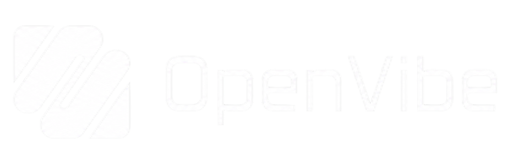

<p align="center" style="margin:0">
  
</p>

<p align="center">
  <a href="https://github.com/nihmadev/OpenVibe">GitHub</a> ·
  <a href="mailto:lolz@nihmadev.fun">lolz@nihmadev.fun</a> ·
  <a href="README-RU.md">Русский</a> ·
  <a href="README-ZH-TW.md">繁體中文</a>
</p>

<p align="center">
  <a href="https://github.com/nihmadev/OpenVibe/actions"></a>
  <a href="LICENSE"></a>
  
  
  
  
  
  
  
</p>

---

OpenVibe is an open-source, locally running agentic coding environment built with Tauri, Rust, React, and Monaco. It combines an AI conversation workspace, code editing, source control, terminal and language-server integration, MCP tools, sub-agent research, and an isolated agent-controlled browser in one lightweight desktop application.

## Highlights

- **Agentic development flow** — streamed reasoning and tool activity, multi-turn execution, todos, rollback, reviewable file changes, token usage, prompt caching, and automatic context compaction.
- **Browser automation** — an isolated Chromium/CDP session that the agent can navigate, inspect, click, type into, and capture while the user can take over manual control when needed.
- **Complete project workspace** — unified project/chat sidebar, Monaco editor and diff viewer, file tree, ignore-aware search, Git status and commit graph, LSP support, and a tabbed xterm.js terminal.
- **Extensible tools** — built-in filesystem, shell, Git, web, browser, todo, skill, and research sub-agent tools plus dynamically discovered MCP tools.
- **Provider freedom** — a bundled and refreshable `models.dev` catalog, first-class popular-provider templates, custom OpenAI-compatible endpoints, and local models through Ollama, LM Studio, or vLLM.
- **Deep customization** — 40 bundled themes, separate light/dark palettes, theme import/export, 38 selectable UI languages, lazy-loaded UI/code fonts, configurable layout styling, zoom, and animation behavior.

## Product Capabilities

### Agent, Context, and Review

The agent uses a native incremental SSE pipeline for OpenAI- and Anthropic-style providers. Responses, reasoning, tool arguments, usage, cache statistics, time to first token, and throughput are emitted as structured events and rendered as one linear activity flow.

- Token-aware compaction keeps the original task, recent turns, tool state, and file snapshots while reducing older conversation history.
- Stable prompt-cache keys and moving cache breakpoints reduce repeated input processing on supported providers and proxies.
- Focused tool profiles keep the prompt small by loading Git, web, research, browser, and per-server MCP schemas only when requested or used.
- Successful agent edits retain before/after snapshots and can be inspected, accepted, rejected, or safely restored through Monaco diff views.
- `@` file mentions, images, and document attachments add explicit context; inline previews keep that context visible in the conversation.
- Configurable permission modes control shell, filesystem, browser, and other sensitive capabilities.

### Integrated Browser

OpenVibe runs browser automation in an isolated Chromium process controlled over the Chrome DevTools Protocol. The Browser panel provides an address bar, navigation controls, multiple tabs, live page frames, agent-pointer visualization, and manual user control. Browser tools cover navigation, accessibility snapshots, clicks, text input, keyboard actions, hover, scrolling, history, tabs, screenshots, and waits. Navigation policy blocks privileged and local URL schemes before they reach Chromium.

### Workspace, Editor, Git, and Search

- The unified sidebar combines projects with expandable project conversations, pinned/recent chats, search, and project/chat actions.
- Monaco provides multi-tab editing, cached document models, code and diff viewers, syntax highlighting, configurable typography, and image/video viewers.
- Source control includes staged and unstaged groups, file actions, branch switching, diffs, commit creation, history, and a visual commit graph.
- Source search and agent file access share bounded, ignore-aware filesystem traversal and path policy.
- A lightweight real-time project tree supplies repository structure to the agent without the removed AST/vector indexing stack.

### MCP, LSP, and Terminal

- Local MCP servers communicate over stdio/JSON-RPC 2.0; discovered tools are registered as `mcp__<server>__<tool>` and surfaced through live configuration and status views.
- Language Server Protocol support manages server installation, processes, and editor connections for common development languages.
- The integrated xterm.js terminal supports multiple native PTY sessions, shell detection, resizing, and real-time output streaming.

### Providers and Personalization

OpenVibe ships with a bundled `models.dev` provider/model snapshot, loads it lazily, caches updates locally, and refreshes it in the background. Popular services such as Anthropic, OpenAI, Google Gemini, DeepSeek, Groq, OpenRouter, Ollama, Mistral, xAI, AWS Bedrock, Azure OpenAI, GitHub Models, and many others have ready-to-use templates. Custom providers support arbitrary base URLs, headers, keys, model IDs, and parameters.

The Zazaru-based interface includes 40 bundled themes, editable light and dark color schemes, UI and code font selection, borders, radii, tabs, blur, zoom, animation controls, a modular icon system, and 38 selectable interface languages.

## Architecture

OpenVibe has three runtime areas:

- the React/TypeScript renderer under `src/`, organized into dependency-ordered `base`, `platform`, and `workbench` layers;
- the Tauri host under `src-tauri/`, which exposes thin commands and owns long-lived runtime managers;
- focused Rust services under `crates/`, connected through explicit contracts and event sinks.

The 16 Rust crates are:

- **`agent-api`** — shared agent messages, events, snapshots, tool definitions, and executor contracts.
- **`llm`** — provider requests, transforms, cancellation, token accounting, and SSE decoding.
- **`agent`** — orchestration, prompts, compaction, rollback, snapshots, summaries, and tool profiles.
- **`agent-tool`** — filesystem, shell, Git, search, MCP, browser, web, todo, skill, and sub-agent tools.
- **`browser`** — isolated Chromium installation/lifecycle, CDP, navigation, input, snapshots, tabs, and screencasts.
- **`fs`** — shared path policy, ignore handling, bounded text scans, and filesystem walking.
- **`runtime`** — downloadable language runtime installation and management.
- **`search`** — cached bounded source search built on the shared filesystem boundary.
- **`lsp`** — language-server process and protocol management.
- **`mcp`** — MCP process lifecycle, JSON-RPC transport, tool discovery, and execution.
- **`git`** — repository operations through libgit2.
- **`db`** — project and application persistence through bundled SQLite.
- **`chats`** — conversation storage and serialization.
- **`terminal`** — terminal process lifecycle and streaming.
- **`editor`** — document state and editor-oriented filesystem operations.
- **`config`** — application and provider configuration types.

The optional Go service under `api/` proxies provider requests, prewarms connections, handles timeouts and health checks, and supports update verification. See [docs/architecture.md](docs/architecture.md) for the complete dependency rules, runtime boundaries, and state/event flow.

## Development

### Requirements

- Node.js `>= 18`
- Stable Rust toolchain (`cargo`, `rustc`)
- Linux, macOS, or Windows

The browser feature uses an installed Chrome/Chromium when available and can download a managed Chromium runtime on demand.

### Install and Run

```bash
git clone https://github.com/nihmadev/OpenVibe.git
cd OpenVibe
npm install
npm run dev
```

`npm install` also copies Monaco runtime assets from the installed package. `npm run dev` starts the Vite renderer and Tauri desktop host.

### Build and Verify

```bash
npm run build              # Build the renderer and native Tauri application
npm run check              # Architecture, TypeScript, ESLint, and Biome checks
npm test                   # Frontend unit and integration tests with Vitest
cargo test --workspace     # Rust workspace tests
```

## Changelog and License

Release history is available in [CHANGELOG.md](CHANGELOG.md). OpenVibe is distributed under the GNU General Public License v3.0 or later; see [LICENSE](LICENSE).
