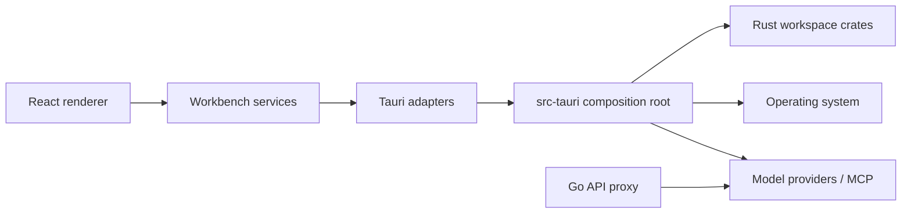
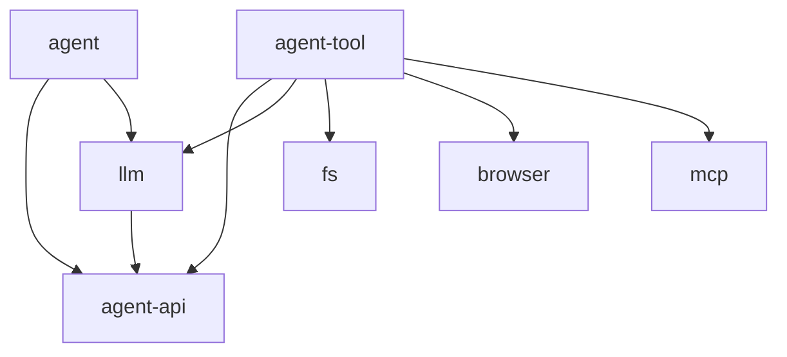

# OpenVibe architecture

This document describes the current application architecture and the rules used
to keep it modular. It is a map of the code that exists today, not a target-state
proposal.

## System overview

OpenVibe is a Tauri desktop application with three runtime areas:

- a React and TypeScript renderer under `src/`;
- a Rust host and command adapter under `src-tauri/`, backed by focused crates
  under `crates/`;
- the optional Go API proxy under `api/`, which normalizes upstream provider
  requests without becoming part of the desktop process.

The desktop boundary is explicit: the renderer calls typed service adapters,
those adapters invoke Tauri commands, and Tauri composes the Rust crates. Domain
logic should not be implemented in a command handler or React component when it
can live behind one of those boundaries.



## Frontend layers

The renderer follows a layered workbench architecture. Imports point downward:

```text
openvibe.desktop.main.tsx       composition root
            |
            v
src/workbench/                  application and product features
            |
            v
src/platform/                   application-wide runtime services
            |
            v
src/base/                       environment-light primitives and UI building blocks
```

### `src/base`

`base` contains the lowest-level reusable code:

- `base/common` contains small platform-neutral utilities such as path and ID
  helpers;
- `base/browser` contains DOM-oriented primitives, common icons, tooltips,
  context menus, and renderer-only helpers.

`base` must not import `platform` or `workbench`. Code in a `common` directory
must not import a `browser` or `tauri` implementation.

### `src/platform`

`platform` contains services shared by the whole desktop renderer but unrelated
to a specific product feature:

- configuration and animation settings;
- keybinding definitions and dispatch;
- localization catalogs and the localization provider;
- theme and font registration;
- storage contracts;
- native Tauri adapters for clipboard, window, listener, and system operations.

`platform` may depend on `base`, but must not depend on `workbench`. Contracts
belong in `common`; concrete environment integrations belong in `browser` or
`tauri`.

### `src/workbench`

`workbench` owns the desktop application shell and OpenVibe product behavior:

- `workbench/browser` composes the titlebar, editor, sidebars, layout, startup,
  and fatal/loading states;
- `workbench/common` holds types shared across workbench features;
- `workbench/contrib/<feature>` contains visible feature contributions such as
  chat, explorer, browser, search, source control, preferences, terminal, and
  onboarding;
- `workbench/services/<domain>` owns reusable application capabilities such as
  agents, chats, files, language servers, providers, and workspaces.

A contribution represents a user-facing feature. A service represents a
capability that can be consumed by more than one feature. Moving reusable logic
from `contrib` to `services` prevents view-to-view coupling.

Feature and service folders use environment suffixes consistently:

- `common`: contracts, serializable data, and pure logic;
- `browser`: React hooks, browser state, and renderer implementations;
- `tauri`: IPC adapters and native event bridges;
- `data`: static catalogs or generated data without runtime behavior.

### Composition root

`src/openvibe.desktop.main.tsx` is the renderer composition root. It registers
platform implementations, initializes native bridges, selects the browser
preview or Tauri runtime, and injects feature contributions into the workbench.
The shell accepts contribution interfaces rather than importing every concrete
view internally. This keeps shell layout separate from product feature code.

## Rust workspace

The Rust side is divided by responsibility rather than by Tauri command group.
`src-tauri` is the composition root: it owns application state, exposes commands,
connects event sinks, and wires the crates together.

### Agent and model pipeline

- `agent-api`: stable shared contracts for messages, events, snapshots, tool
  definitions, and the tool executor interface. It has no dependency on the
  agent implementation.
- `llm`: provider request construction, cancellation, token accounting,
  transforms, and SSE decoding for OpenAI- and Anthropic-style streams.
- `agent`: the orchestration loop, prompt construction, compaction, rollback,
  snapshots, summaries, and tool profile selection. It depends on `agent-api`
  and `llm`.
- `agent-tool`: implementations of filesystem, shell, search, MCP, browser,
  todo, web, and sub-agent tools. It implements the executor contract from
  `agent-api` instead of creating a dependency cycle with `agent`.

The contract crate is intentionally below both orchestration and tools:



### Infrastructure and domain crates

- `browser`: isolated Chromium lifecycle and installation, Chrome DevTools
  Protocol transport, navigation policy, page snapshots, input, tabs, and
  screencast events;
- `fs`: shared path policy, ignore handling, bounded text scanning, glob
  matching, and filesystem walking;
- `runtime`: downloadable runtime installation and lifecycle management;
- `search`: source search and caching built on the shared filesystem policy;
- `lsp`: language-server process and protocol management;
- `mcp`: MCP server lifecycle and JSON-RPC transport;
- `chats`: conversation storage and serialization;
- `config`: application and provider configuration types;
- `db`: project and application SQLite persistence;
- `editor`: document state and editor-oriented filesystem operations;
- `git`: repository operations through libgit2;
- `terminal`: terminal process lifecycle and streaming.

### Tauri host

`src-tauri/src/lib.rs` creates long-lived managers in `AppState`. Command modules
translate IPC payloads into crate calls and translate results into serializable
responses. They should remain thin: validation that is intrinsic to a domain
belongs in its crate, while permission prompts and desktop lifecycle behavior
belong at the Tauri boundary.

Agent execution demonstrates the intended dependency inversion. `agent` only
knows the `ToolExecutor` contract. `src-tauri` creates `AgentToolExecutor`, gives
it access to approved managers, and supplies it to the agent. Browser events and
agent stream events return through explicit sinks rather than making the lower
crates depend on Tauri.

## Browser automation boundary

Browser automation runs in a dedicated Chromium process controlled through CDP.
The browser crate owns lifecycle and protocol details. The agent tool layer owns
tool schemas and skill disclosure. Tauri owns UI event forwarding and manager
lifetime. The frontend browser contribution renders state and sends commands
through its Tauri service.

Navigation accepts ordinary HTTP(S) pages and `about:blank`; privileged and local
schemes are rejected by the Rust policy before reaching Chromium. Skill content
must be read before browser actions are made, so operational constraints travel
with the tool instead of relying only on prompt text elsewhere.

## State and event flow

State has an explicit owner:

- persistent project and chat data is stored by Rust/SQLite crates;
- renderer preferences use the platform key-value store contract;
- transient view and layout state remains in React hooks;
- runtime managers live in Tauri `AppState`;
- streamed agent, browser, filesystem, and workspace updates cross the IPC
  boundary as events and are normalized by frontend event services.

Avoid duplicating authoritative state on both sides of IPC. Frontend mirrors
should be treated as projections that can be restored from their owning service.

## Architectural principles

1. **Dependencies point inward and downward.** Base utilities know nothing about
   the application; platform services know nothing about product features;
   contracts do not import environment implementations.
2. **Composition happens at the edge.** Concrete contributions and adapters are
   wired in the renderer entrypoint or the Tauri host, not in low-level modules.
3. **Contracts break cycles.** Shared Rust contracts live in `agent-api`; shared
   TypeScript contracts live in `common` directories.
4. **Environment-specific code is visible in the path.** DOM logic belongs in
   `browser`, native IPC in `tauri`, and pure code in `common`.
5. **Managers own resources.** Browser, language-server, MCP, terminal, and
   runtime processes have a single lifecycle owner in Tauri state.
6. **Views consume services.** React components render and coordinate user
   intent; persistence, IPC, protocol, and filesystem behavior live in services
   or Rust crates.
7. **Security policy is enforced near the capability.** URL validation, path
   limits, ignore rules, and tool approval are not left to UI convention.
8. **Moves preserve intent.** Mechanical relocation should be separated from
   later behavior changes when practical, keeping history and blame useful.

## Automated checks

`npm run check:architecture` scans TypeScript imports and rejects the most
important dependency inversions:

- `base` importing `platform` or `workbench`;
- `platform` importing `workbench`;
- a `common` module importing a `browser` or `tauri` implementation.

The full frontend check is `npm run check`; Rust boundaries are validated by
`cargo check --workspace` and the workspace test suite. The checker is a guardrail,
not a replacement for reviewing ownership and dependency direction.

## Adding code

- Put a reusable pure helper in `base/common`.
- Put application-wide configuration or an environment adapter in `platform`.
- Put a visible, independently named product feature in `workbench/contrib`.
- Put a reusable product capability in `workbench/services`.
- Add protocol or resource-management logic to the focused Rust crate and keep
  its Tauri command adapter thin.
- Introduce a contract module when two implementations would otherwise depend
  on each other.

When a change does not fit one of these locations, first identify who owns its
state and which runtime capability it needs. Those two answers normally reveal
the correct layer.
